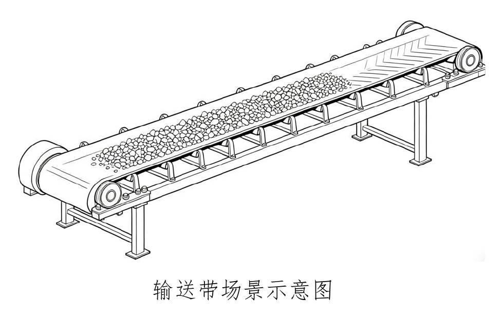

# 6. 混凝土骨料颗粒智能筛分比拼

在混凝土生产中，骨料的粒径分布、形状特征和含泥量等参数直接影响混凝土的工作性能和力学性能。传统的人工筛分检测方式效率低、滞后性强，难以满足智能化生产线的实时控制需求。

本赛题针对骨料在混凝土生产过程中的转运环节，如仓库存储、传送带输送等，要求参赛队伍采用或设计合适的自动化、智能化技术或者装备，通过非人工筛分的方式，进行混凝土骨料颗粒筛分。

## （1）任务目标

大赛组委会在比赛现场提供两组骨料材料，一组自然堆积，一组可用于模拟传送带，参赛队伍可选择任一组骨料，采用自主开发的技术、设备等，在规定时间内，以非人工筛分的方式完成骨料颗粒的筛分、粒径分布计算和形貌识别，并用 PPT 等形式对完成的项目进行答辩阐述，包括但不限于：技术原理、方案思路、数据处理、筛分结果等。

## （2）硬件环境（自选其一）

### 1）传动带输送

- 传送带宽度：≥ 500 mm，速度可调（0.1–0.5 m/s）
- 骨料颗粒：破碎骨料，粒径范围 5 mm–40 mm

### 2）自然堆积

- 骨料颗粒：破碎骨料，粒径范围 5 mm–40 mm

## （3）任务要求

1. **精细识别**：在自然堆积状态或在传送带运行过程中，对骨料颗粒进行检测与分割，区分颗粒与地面或传送带背景、颗粒与颗粒之间的粘连。
2. **粒径分析**：输出可见颗粒的直径（或长径、短径），统计粒径分布（如 D10、D50、D90）。
3. **形状分类（可选加分项）**：指出针片状、圆形、棱角状等颗粒形态。
4. **异常检测**：识别大块异物（>50 mm）或泥团等非骨料物质。

## （4）规则要求

- 现场采集时间：现场图像采集与设备调试时间 ≤30 分钟。
- 检测手段和方法不限，须为非传统人工方式。
- 评分维度：以标准筛分结果为准，根据粒径误差、颗粒识别准确率、算法创新性及现场答辩表现进行综合评价。

## （5）提交材料

初赛需提交如下材料：

1. 参赛答辩 PPT（论述参赛思路和前期准备，充分证明具备完成任务的能力）；
2. 核心检测识别程序代码框架（含注释说明关键算法）；
3. 所采用的设备型号、参数、指标等；
4. 技术报告（说明设计思路、难点解决方案、测试验证等）。

决赛要求以正式决赛通知为主。
